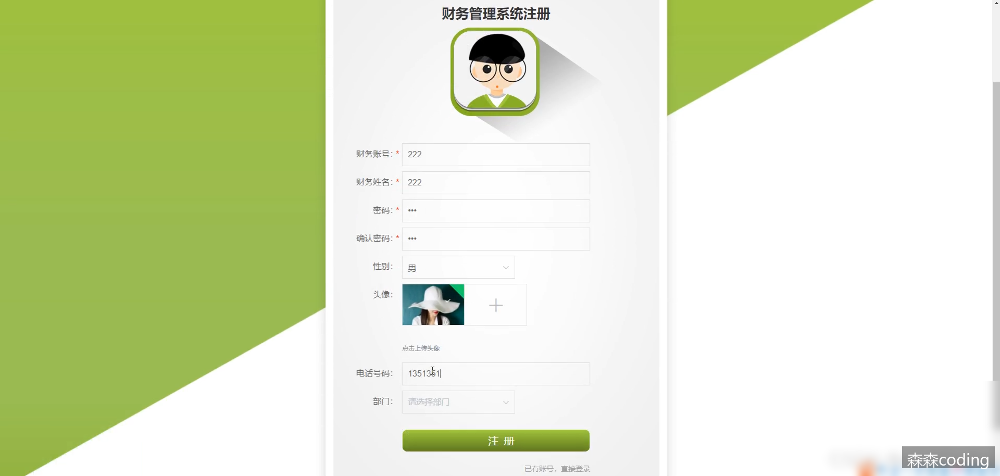
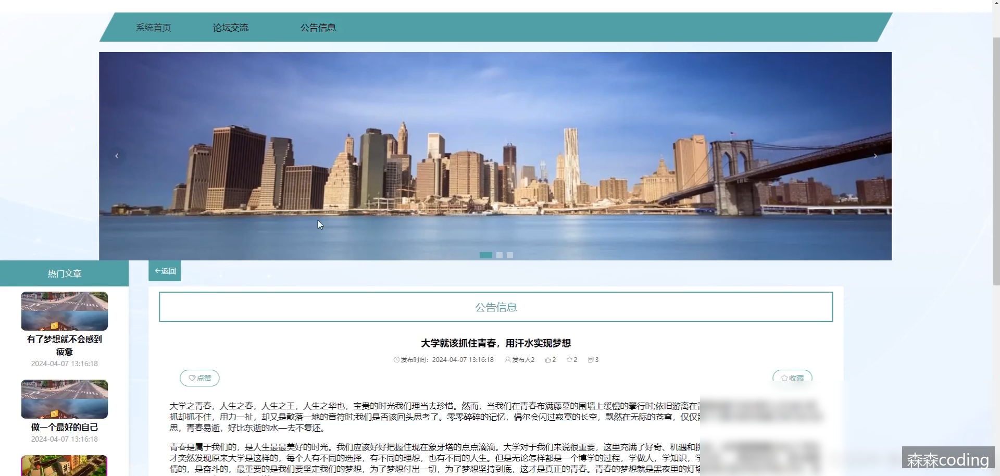

# 基于ssm+vue.js+uniapp小程序的财务管理系统附带文章源码部署视频讲解等

> **发布时间**: 2024-11-27
> **标签**: #vue.js, #uni-app, #小程序

---

## 📞 联系方式
> 💬 **微信：sen232sen** | 🚀 **专业定制各类管理系统** | ⭐ **源码获取/技术支持**

---

##

  * 前言
  * 详细视频演示
  * 具体实现截图
  * 核心技术介绍
  *     * 后端框架SSM
    * 前端框架Vue
    * 持久层框架MyBaits
  * 为什么选择我
  * 代码参考
  * 数据库参考
  * 测试用例参考
  * 源码获取

## 📞 联系方式
> 💬 **微信：sen232sen** | 🚀 **专业定制各类管理系统** | ⭐ **源码获取/技术支持**

---

## 前言

🌞**博主介绍** ：✌CSDN特邀作者、资深全栈开发程序员，曾在互联网大厂担任高级职位、码云/掘金/华为云/阿里云/InfoQ/StackOverflow/github等平台优质作者、专注于Java、小程序、前端、python等技术领域毕业项目实战，以及程序定制化开发、全栈讲解、就业辅导、面试辅导、简历修改。✌🌞

> 

## 详细视频演示

请联系我获取更详细的演示视频

## 具体实现截图

  

## 核心技术介绍

### 后端框架SSM

SSM框架是一种基于Spring、Spring MVC和MyBatis的开发框架，它们分别负责不同的功能模块，共同构建了一个完整的Java Web应用程序。下面是对SSM框架的三个组成部分的简要介绍：

  1. **Spring框架** ：Spring是一个轻量级的Java开发框架，提供了广泛的功能，包括依赖注入、面向切面编程（AOP）、事务管理等。Spring的核心容器管理了应用程序中的对象，使得对象之间的依赖关系更加清晰，并且降低了耦合度。

  2. **Spring MVC框架** ：Spring MVC是Spring框架的一部分，用于构建Web应用程序。它基于MVC（Model-View-Controller）设计模式，将应用程序分为模型（Model）、视图（View）和控制器（Controller）三层。模型负责处理业务逻辑，视图负责展示数据，控制器负责处理用户请求和调度逻辑。

  3. **MyBatis框架** ：MyBatis是一个持久层框架，它简化了与数据库的交互过程。通过配置映射文件，开发人员可以将Java对象映射到数据库表中，并且可以通过SQL语句进行数据库操作。MyBatis提供了一种优雅的方式来管理数据库访问代码，并且能够很好地与Spring集成。

SSM框架的优点包括灵活性高、配置简单、易于学习和使用等。它们的结合使得开发人员可以快速搭建起一个稳定、高效的Java Web应用程序。

### 前端框架Vue

Vue.js是一种流行的JavaScript框架，它具有许多优势。其中，Vue.js的核心优势之一是虚拟DOM技术。虚拟DOM是一个内存中的数据结构，它在实现高效的DOM操作方面发挥了重要作用。

Vue.js采用了响应式数据绑定、虚拟DOM、组件化等现代化技术，为开发者提供了一种灵活、高效、易于维护的开发模式。当数据发生变化时，Vue.js能够自动更新UI，开发者无需手动更新UI，从而能够更加专注于数据处理。

### 持久层框架MyBaits

MyBatis是一个开源的持久层框架，它可以帮助开发者简化数据库操作的编写和管理。MyBatis的核心思想是将SQL语句和Java代码分离，通过XML或注解的方式来描述数据库操作，从而实现了数据访问层的解耦和灵活性。

MyBatis的优势主要包括以下几点：

  1. 简化数据库操作：MyBatis通过提供强大的SQL映射功能，可以将Java对象与数据库表进行映射，开发者无需手动编写繁琐的SQL语句，大大简化了数据库操作的编写和维护。

  2. 灵活的SQL控制：MyBatis支持动态SQL，可以根据不同的条件和逻辑来动态生成SQL语句，使得查询、更新等操作更加灵活和可控。

  3. 缓存支持：MyBatis提供了一级缓存和二级缓存的支持，可以有效减少数据库的访问次数，提高系统性能。

  4. 可扩展性强：MyBatis采用插件机制，可以方便地扩展和定制自己的功能，满足各种不同的业务需求。

## 为什么选择我

  
博主提供的项目均为博主自己收集和开发的！所有的源码都经由博主检验过，能过正常启动并且功能都没有问题！同学们拿到后就能使用！且博主自身就是高级开发，可以将所有的代码都清晰讲解出来。  
多个成功系统案例：  
  

## 代码参考

    // 忽略权限验证的注解
    @IgnoreAuth
    @PostMapping(value = "/login")
    public R login(String username, String password, String captcha, HttpServletRequest request) {
       // 查询用户信息
       UsersEntity user = userService.selectOne(new EntityWrapper<UsersEntity>().eq("username", username));
       // 判断用户是否存在或密码是否正确
       if(user==null || !user.getPassword().equals(password)) {
          return R.error("账号或密码不正确");
       }
       // 生成token
       String token = tokenService.generateToken(user.getId(),username, "users", user.getRole());
       return R.ok().put("token", token);
    }
    
    // 生成token
    @Override
    public String generateToken(Long userid,String username, String tableName, String role) {
       // 查询是否存在已有token
       TokenEntity tokenEntity = this.selectOne(new EntityWrapper<TokenEntity>().eq("userid", userid).eq("role", role));
       // 生成随机token字符串
       String token = CommonUtil.getRandomString(32);
       // 设置token过期时间为1小时后
       Calendar cal = Calendar.getInstance();   
       cal.setTime(new Date());   
       cal.add(Calendar.HOUR_OF_DAY, 1);
       if(tokenEntity!=null) {
          // 更新token信息
          tokenEntity.setToken(token);
          tokenEntity.setExpiratedtime(cal.getTime());
          this.updateById(tokenEntity);
       } else {
          // 新建token记录
          this.insert(new TokenEntity(userid,username, tableName, role, token, cal.getTime()));
       }
       return token;
    }
    
    /**
     * 权限(Token)验证拦截器
     */
    @Component
    public class AuthorizationInterceptor implements HandlerInterceptor {
    
        // 定义Token在请求Header中的键名
        public static final String LOGIN_TOKEN_KEY = "Token";
    
        @Autowired
        private TokenService tokenService;
        
        @Override
        public boolean preHandle(HttpServletRequest request, HttpServletResponse response, Object handler) throws Exception {
            // 支持跨域请求
            response.setHeader("Access-Control-Allow-Methods", "POST, GET, OPTIONS, DELETE");
            response.setHeader("Access-Control-Max-Age", "3600");
            response.setHeader("Access-Control-Allow-Credentials", "true");
            response.setHeader("Access-Control-Allow-Headers", "x-requested-with,request-source,Token, Origin,imgType, Content-Type, cache-control,postman-token,Cookie, Accept,authorization");
            response.setHeader("Access-Control-Allow-Origin", request.getHeader("Origin"));
    
            // 跨域时会首先发送一个OPTIONS请求，这里我们给OPTIONS请求直接返回正常状态
            if (request.getMethod().equals(RequestMethod.OPTIONS.name())) {
                response.setStatus(HttpStatus.OK.value());
                return false;
            }
            
            // 获取HandlerMethod注解
            IgnoreAuth annotation;
            if (handler instanceof HandlerMethod) {
                annotation = ((HandlerMethod) handler).getMethodAnnotation(IgnoreAuth.class);
            } else {
                return true;
            }
    
            // 从header中获取token
            String token = request.getHeader(LOGIN_TOKEN_KEY);
            
            /**
             * 不需要验证权限的方法直接放过
             */
            if(annotation!=null) {
                return true;
            }
            
            // 根据token获取token实体
            TokenEntity tokenEntity = null;
            if(StringUtils.isNotBlank(token)) {
                tokenEntity = tokenService.getTokenEntity(token);
            }
            
            if(tokenEntity != null) {
                // 将用户信息存入session
                request.getSession().setAttribute("userId", tokenEntity.getUserid());
                request.getSession().setAttribute("role", tokenEntity.getRole());
                request.getSession().setAttribute("tableName", tokenEntity.getTablename());
                request.getSession().setAttribute("username", tokenEntity.getUsername());
                return true;
            }
            
            // 验证失败，返回401错误和提示信息
            PrintWriter writer = null;
            response.setCharacterEncoding("UTF-8");
            response.setContentType("application/json; charset=utf-8");
            try {
                writer = response.getWriter();
                writer.print(JSONObject.toJSONString(R.error(401, "请先登录")));
            } finally {
                if(writer != null){
                    writer.close();
                }
            }
            return false;
        }
    }

## 数据库参考

    DROP TABLE IF EXISTS `address`;
    /*!40101 SET @saved_cs_client     = @@character_set_client */;
    /*!40101 SET character_set_client = utf8 */;
    CREATE TABLE `address` (
      `id` bigint(20) NOT NULL AUTO_INCREMENT COMMENT '主键',
      `addtime` timestamp NOT NULL DEFAULT CURRENT_TIMESTAMP COMMENT '创建时间',
      `userid` bigint(20) NOT NULL COMMENT '用户id',
      `address` varchar(200) NOT NULL COMMENT '地址',
      `name` varchar(200) NOT NULL COMMENT '收货人',
      `phone` varchar(200) NOT NULL COMMENT '电话',
      `isdefault` varchar(200) NOT NULL COMMENT '是否默认地址[是/否]',
      PRIMARY KEY (`id`)
    ) ENGINE=InnoDB AUTO_INCREMENT=9 DEFAULT CHARSET=utf8 COMMENT='地址';
    
    DROP TABLE IF EXISTS `forum`;
    /*!40101 SET @saved_cs_client     = @@character_set_client */;
    /*!40101 SET character_set_client = utf8 */;
    CREATE TABLE `forum` (
      `id` bigint(20) NOT NULL AUTO_INCREMENT COMMENT '主键',
      `addtime` timestamp NOT NULL DEFAULT CURRENT_TIMESTAMP COMMENT '创建时间',
      `title` varchar(200) DEFAULT NULL COMMENT '帖子标题',
      `content` longtext NOT NULL COMMENT '帖子内容',
      `parentid` bigint(20) DEFAULT NULL COMMENT '父节点id',
      `userid` bigint(20) NOT NULL COMMENT '用户id',
      `username` varchar(200) DEFAULT NULL COMMENT '用户名',
      `avatarurl` longtext COMMENT '头像',
      `isdone` varchar(200) DEFAULT NULL COMMENT '状态',
      `istop` int(11) DEFAULT '0' COMMENT '是否置顶',
      `toptime` datetime DEFAULT NULL COMMENT '置顶时间',
      PRIMARY KEY (`id`)
    ) ENGINE=InnoDB AUTO_INCREMENT=79 DEFAULT CHARSET=utf8 COMMENT='交流论坛';
    
    DROP TABLE IF EXISTS `yonghu`;
    /*!40101 SET @saved_cs_client     = @@character_set_client */;
    /*!40101 SET character_set_client = utf8 */;
    CREATE TABLE `yonghu` (
      `id` bigint(20) NOT NULL AUTO_INCREMENT COMMENT '主键',
      `addtime` timestamp NOT NULL DEFAULT CURRENT_TIMESTAMP COMMENT '创建时间',
      `zhanghao` varchar(200) NOT NULL COMMENT '账号',
      `mima` varchar(200) NOT NULL COMMENT '密码',
      `xingming` varchar(200) NOT NULL COMMENT '姓名',
      `xingbie` varchar(200) DEFAULT NULL COMMENT '性别',
      `shouji` varchar(200) DEFAULT NULL COMMENT '手机',
      `touxiang` longtext COMMENT '头像',
      `jf` double DEFAULT '0' COMMENT '积分',
      `money` double DEFAULT '0' COMMENT '余额',
      PRIMARY KEY (`id`),
      UNIQUE KEY `zhanghao` (`zhanghao`)
    ) ENGINE=InnoDB AUTO_INCREMENT=19 DEFAULT CHARSET=utf8 COMMENT='用户';

– 向数据库插入数据示例

    INSERT INTO `product` (`name`, `price`, `description`, `stock`)
    VALUES ('iPhone 13', 999.99, 'A powerful and advanced smartphone', 100);
    
    INSERT INTO `product` (`name`, `price`, `description`, `stock`)
    VALUES ('Samsung Galaxy S21', 899.99, 'A flagship Android smartphone', 150);
    
    INSERT INTO `product` (`name`, `price`, `description`, `stock`)
    VALUES ('Sony PlayStation 5', 499.99, 'Next-gen gaming console', 50);

## 测试用例参考

输入数据| 预期结果| 实际结果| 结果分析  
---|---|---|---  
用户名：guanliyuan 密码：123456 验证码：正确输入| 登录系统| 成功登录系统| 结果一致  
用户名：guanliyuan 密码：111111 验证码：正确输入| 密码错误| 密码错误，请重新输入密码| 结果一致  
用户名：guanliyuan 密码：123456 验证码：错误输入| 验证码错误| 验证码信息错误| 结果一致  
用户名：空 密码：123456 验证码：正确输入| 用户名必填| 请输入用户名| 结果一致  
用户名：guanliyuan 密码：空 验证码：正确输入| 密码错误| 密码错误，请重新输入密码| 结果一致  
  
另外，本系统还进行了用户管理功能的测试。用户管理包括添加、编辑、删除和查找用户等功能。本系统测试了以下各项功能的测试用例：

  1. 添加用户功能测试用例：

输入数据| 预期结果| 实际结果| 结果分析  
---|---|---|---  
用户名：user1 密码：123456 角色：普通用户| 添加成功，并在用户列表中显示| 用户列表中出现用户1| 结果一致  
用户名：user2 密码：111111 角色：普通用户| 添加成功，并在用户列表中显示| 用户列表中出现用户2| 结果一致  
用户名：user1 密码：123456 角色：普通用户| 添加失败，提示用户名已存在| 添加失败，提示用户名已存在| 结果一致  
用户名：空 密码：123456 角色：普通用户| 添加失败，提示用户名不能为空| 添加失败，提示用户名不能为空| 结果一致  
  
  2. 编辑用户功能测试用例：

输入数据| 预期结果| 实际结果| 结果分析  
---|---|---|---  
选择用户1，修改密码为654321| 编辑成功，密码修改成功| 用户1密码已修改为654321| 结果一致  
选择用户2，修改角色为管理员| 编辑成功，角色修改成功| 用户2角色已修改为管理员| 结果一致  
选择用户1，清空用户名| 编辑失败，提示用户名不能为空| 编辑失败，提示用户名不能为空| 结果一致  
  
  3. 删除用户功能测试用例：

输入数据| 预期结果| 实际结果| 结果分析  
---|---|---|---  
选择用户1进行删除操作| 系统询问是否删除用户，确认后用户被删除| 用户1已成功删除| 结果一致  
选择用户2进行删除操作| 系统询问是否删除用户，取消删除操作| 用户2未被删除| 结果一致  
  
通过系统功能测试，确保系统的功能完备性，系统能够按照需求规格说明书的定义正常运行。我们将继续进行测试工作，发现并修复潜在问题，为用户提供功能完善的系统体验。

## 源码获取
> 💬 **微信：sen232sen**
> 
> 🚫 **白嫖勿扰** 😊

文章下方名片联系我即可~  
大家点赞、收藏、关注、评论啦 、查看👇🏻获取联系方式👇🏻  
精彩专栏推荐订阅：在下方专栏👇🏻

> [2024-2025年最值得选的微信小程序毕业设计选题大全：100个热门选题推荐✅](https://blog.csdn.net/2401_82799502/article/details/141282653?spm=1001.2014.3001.5501)  
>  [2024-2025年最值得选的Java毕业设计选题大全：100个热门选题推荐✅](https://blog.csdn.net/2401_82799502/article/details/141282893?spm=1001.2014.3001.5501)  
>  [2024-2025年最值得选的Python毕业设计选题大全：100个热门选题推荐✅](https://blog.csdn.net/2401_82799502/article/details/141283098?spm=1001.2014.3001.5501)  
>  [2024-2025年最值得选的PHP毕业设计选题大全：100个热门选题推荐✅](https://blog.csdn.net/2401_82799502/article/details/141283204?spm=1001.2014.3001.5501)  
>  [2024-2025年最值得选的nodejs毕业设计选题大全：100个热门选题推荐✅](https://blog.csdn.net/2401_82799502/article/details/141283279?spm=1001.2014.3001.5501)  
>  [Java精品实战案例《3000套》](https://blog.csdn.net/2401_82799502/category_12569317.html)  
>  [微信小程序项目精品案例《1000套》](https://blog.csdn.net/2401_82799502/category_12569320.html)  
>  [Java核心技术精选](https://blog.csdn.net/2401_82799502/category_12566134.html)  
>  [Java框架精选](https://blog.csdn.net/2401_82799502/category_12569303.html)

---

